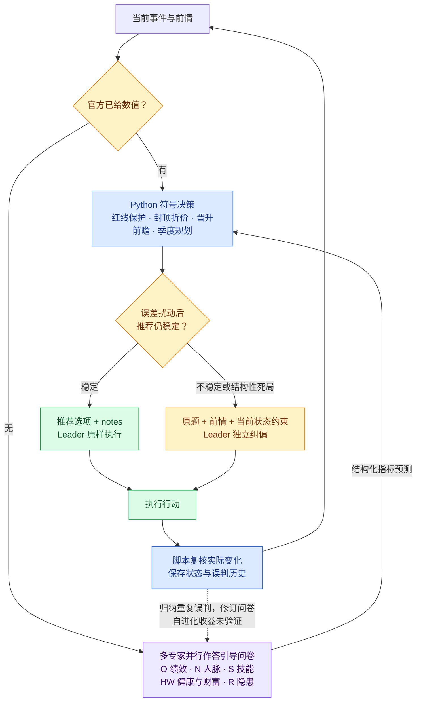

# CCF BDCI 2026「职场长程生存与晋升挑战」比赛的 Solution

## 1. 比赛简介

[华为 openJiuwen 职场长程生存与晋升挑战](https://www.xir.cn/competition/1165)要求 Agent 在 48 个月的职业模拟中处理剧情事件、分配季度行动、通过绩效考核并争取晋升，同时管理健康、尊严、技能、人脉、产出、财富与隐藏风险。我们使用 JiuwenSwarm 多 Agent 协作与 Python 脚本构建方案，以活满 48 个月并提高终局分数为目标。规则见[比赛文档](https://career-emulator.readthedocs.io)。

## 2. 我们的方法



完整设计见[方案设计](solution/design/skills_design.md)与[逐轮决策报告](solution/design/decision_report.md)。

### 2.1 Agent 解释语义，脚本保存状态、计算符号

Agent 负责读懂事件，Python 负责状态持久化、指标投影、约束检查和行动比较。正常推荐时，Leader 只需要接收编号并填写 notes：

```json
{
  "推荐选项": 2,
  "notes": "L2第7月；名义预测绩效产出+2；按红线、晋升门槛与净值选择。"
}
```

相比之下，把完整上下文直接交给 Leader 的信息包会像这样（简化示例）：

```json
{
  "state": {"L": 2, "O": 4, "S": 18, "N": 6, "H": 8, "D": 5, "W": 4, "R": 0},
  "month": 7,
  "current_event": {"title": "同事求助", "description": "交付在即，同事请你帮忙排查故障。"},
  "options": [
    {"choice": 1, "action": "帮忙排查", "metrics": {"O": -1, "N": 1}},
    {"choice": 2, "action": "完成自己的关键交付", "metrics": {"O": 2}}
  ],
  "守红线": "无已触发项",
  "补短板": "绩效产出差1分晋升；专业技能与人脉恰好达标"
}
```

精简后的接口把读题、维护状态、计算收益与执行行动的职责分开，让 Leader 专注于当前动作。只有进入纠偏时，才交回原题与前情；此时不附带预测增量或推荐偏好。

### 2.2 多专家独立打分，用问卷拆解语义判断

五位专家各自负责 O、N、S、HW、R，在独立上下文中并行作答。比如绩效产出专家依次判断：属于核心业务还是其他事务、成果与进度如何变化、影响幅度有多大。脚本将答案映射为各选项的 O 增量，误判也能追溯到具体问题。

查看[绩效产出引导问卷](solution/skills/observe-decide-review/scripts/questionnaires/O.json)与[专家判断原则](solution/skills/observe-decide-review/stages/translate_O.md)。

### 2.3 用固定规则保持长程一致性

脚本按当前职级与月份检查红线、比较晋升缺口，并对封顶收益和资格线回退定价；季度行动通过组合前瞻规划，每次仍只推荐当前的一步。健康、尊严与财富进入低位保护后，其他收益不能换取进一步削减它们。

### 2.4 建模打分误差，让可信度决定谁来拍板

我们从测试数据中的专家预测与真实增量建立条件误差分布，区分指标、预测方向和幅度。离线测试在真实增量上采样误差，模拟不准确的翻译输入；运行时围绕预测增量采样可能的实际效果，重复执行符号决策，以推荐保持不变的比例衡量稳定率。

稳定率低于阈值时，Leader 根据原题、前情与当前状态约束独立判断；否则执行专家量化后的脚本推荐。阈值越高，越多事件进入 Leader 纠偏。这里的可信度是模型下的决策稳定率。

下表为误差组的量化原分中位数（满分 100，每组 128 局，两类路由阈值取相同值）：

| 可信度阈值 | 量化原分中位数 |
|---|---:|
| 0.9 | 53.750 |
| 0.8 | 61.975 |
| 0.75 | 64.950 |
| **0.7** | **65.705** |
| 0.65 | 65.580 |
| 0.6 | 62.810 |
| 0.5 | 60.450 |

这组实验中，偏向 Leader 统一判断的高阈值和偏向专家推荐的低阈值，都未取得最佳分数；**选择性纠偏的混合方案表现更好**。路由机制与实验记录见[决策报告](solution/design/decision_report.md#33-稳定率如何改变行动)。

### 2.5 从重复误判中自进化（提分收益未验证）

专家应从至少两次误判中寻找共同原因，提炼通用经验，再对引导问卷做一处最小修订。改动限于问题文案，保留已有有效边界，取值、流程与算式保持固定；无法归纳重复错误时跳过修改。R 为隐藏指标，缺少公开真值，不参与运行时问卷修订。

机制已实现，尚未验证其提分收益；设计与约束见[自进化机制](solution/design/skills_design.md#73-自进化机制)。
