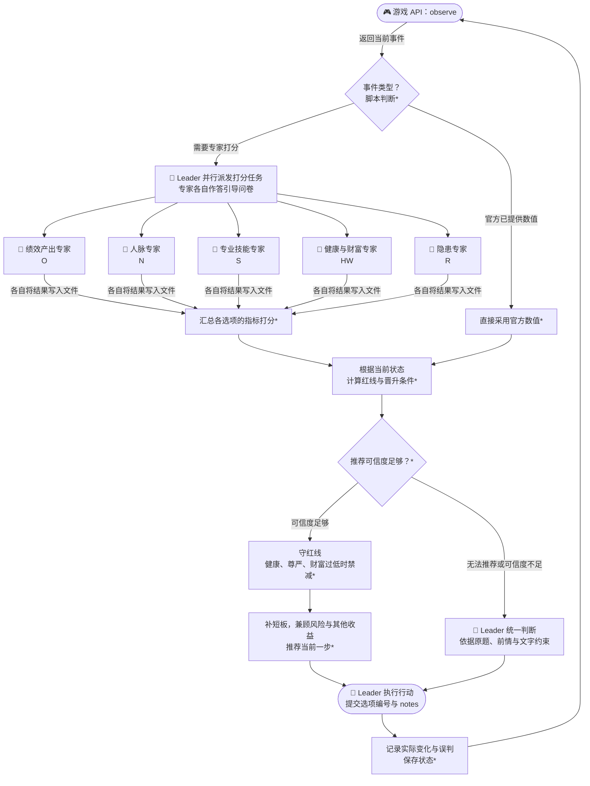

# CCF BDCI 2026「职场长程生存与晋升挑战」比赛的 Solution

## 1. 比赛简介

[华为 openJiuwen 职场长程生存与晋升挑战](https://www.xir.cn/competition/1165)要求 Agent 在 48 个月的职业模拟中处理剧情事件、分配季度行动、通过绩效考核并争取晋升，同时管理健康、尊严、技能、人脉、产出、财富与隐藏风险。我们使用 JiuwenSwarm 多 Agent 协作与 Python 脚本构建方案，以活满 48 个月并提高终局分数为目标。规则见[比赛文档](https://career-emulator.readthedocs.io)。

## 2. 我们的方法



> **图例**：`*` 表示由 Python 脚本完成的步骤；`🤖` 表示由 AI Agent 完成的步骤。

完整设计见[方案设计](solution/design/skills_design.md)与[逐轮决策报告](solution/design/decision_report.md)。

关键 Hacking 技巧: 正常的 team 模式不会清除 teammate 即各专家上下文，一局比赛会造成 > 100 元 deepseek-flash token，按此测试优化将照成超越比赛奖金的花费。因此每个事件都用脚本引导 Leader 运用允许的工具，关闭所有 teammate 并重新建队。

关键迭代策略：teammate 拆分 + 符号化输出，有利于检验中间结果（打分是否正确），并行优化各个打分专家。同时 `Python 符号决策` 也可以配合打分误差模型，按搜索算法快速优化程序。

### 2.1 Agent 解释语义，脚本保存状态、计算符号

Agent 负责读懂事件，Python 负责保存状态、计算符号。以 Leader 统一判断阶段为例，我们把当前状态转换为文字约束，让 Leader 看到的是事件本身与需要遵守的规则：

```json
{
  "current_event": {"title": "同事求助长链",
  "history": "在日常开发中，同事求助你帮忙审查代码。你选择：“完成自己的日常开发任务，“绩效产出”+1，“人脉”-1",
  "description": "交付在即，同事再次请你帮忙排查故障。"},
  "options": [
    {"choice": 1, "action": "帮忙排查"},
    {"choice": 2, "action": "完成自己的关键交付"}
  ],
  "constraints": {
    "守红线": "“身心健康”过低、“个人财富”过低，禁止选择会削减这些指标的行为（-1也不行）；优先补“身心健康”、“个人财富”",
    "晋升条件": "“专业技能”不多不少恰好满足晋升要求；当前短板是“绩效产出”，差1分晋升；“人脉”不多不少恰好满足晋升要求"
  }
}
```

同一事件的 `sim-career observe` 原始返回则包含较为繁杂的状态数值、会话信息与选项元数据：

```json
{
  "current_state": {
    "session_id": "00000000000000000000000000000001",
    "time": {"current_month": 7},
    "status": {"level": "L2", "output": 4, "skill": 18, "network": 6, "health": 3, "dignity": 5, "wealth": 2, "energy": 3}
  },
  "current_event": {"title": "同事求助", "description": "交付在即，同事再次请你帮忙排查故障。"},
  "choices": [
    {"choice": 1, "action": "帮忙排查", "selectable": true},
    {"choice": 2, "action": "完成自己的关键交付", "selectable": true}
  ],
  "events": ""
}
```

### 2.2 多专家独立打分，用问卷拆解语义判断

五位专家各自负责 O、N、S、HW、R，在独立上下文中并行作答。比如绩效产出专家依次判断：属于核心业务还是其他事务、成果与进度如何变化、影响幅度有多大。脚本将答案映射为各选项的 O 增量，误判也能追溯到具体问题。

查看[绩效产出引导问卷](solution/skills/observe-decide-review/scripts/questionnaires/O.json)与[专家判断原则](solution/skills/observe-decide-review/stages/translate_O.md)。


### 2.3 建模打分误差，让可信度决定谁来拍板

我们从测试数据中的专家预测与真实增量建立条件误差分布，区分指标、预测方向和幅度。离线测试在真实增量上采样误差，模拟不准确的翻译输入；运行时围绕预测增量采样可能的实际效果，重复执行符号决策，以推荐保持不变的比例衡量稳定率。

稳定率低于阈值时，Leader 根据原题、前情与当前状态约束独立判断；否则执行专家量化后的脚本推荐。阈值越高，越多事件进入 Leader 纠偏。这里的可信度是模型下的决策稳定率。

下表为误差组的量化原分中位数（满分 100，每组 128 局，两类路由阈值取相同值）：

| 可信度阈值 | 量化原分中位数 |
|---|---:|
| 0.9 | 53.750 |
| 0.8 | 61.975 |
| 0.75 | 64.950 |
| **0.7** | **65.705** |
| 0.65 | 65.580 |
| 0.6 | 62.810 |
| 0.5 | 60.450 |

这组实验中，偏向 Leader 统一判断的高阈值和偏向专家推荐的低阈值，都未取得最佳分数；**选择性纠偏的混合方案表现更好**。路由机制与实验记录见[决策报告](solution/design/decision_report.md#33-稳定率如何改变行动)。

### 2.4 从重复误判中自进化（Token 消耗过多，未做消融验证）

专家应从至少两次误判中寻找典型的错误，提炼通用经验，再对引导问卷做一处最小修订。改动限于问题文案，脚本所有的符号策略保持固定；无法归纳典型错误时，跳过修改。R 为隐藏指标，缺少公开真值，不参与运行时问卷修订。 设计与约束见[自进化机制](solution/design/skills_design.md#73-自进化机制)。
