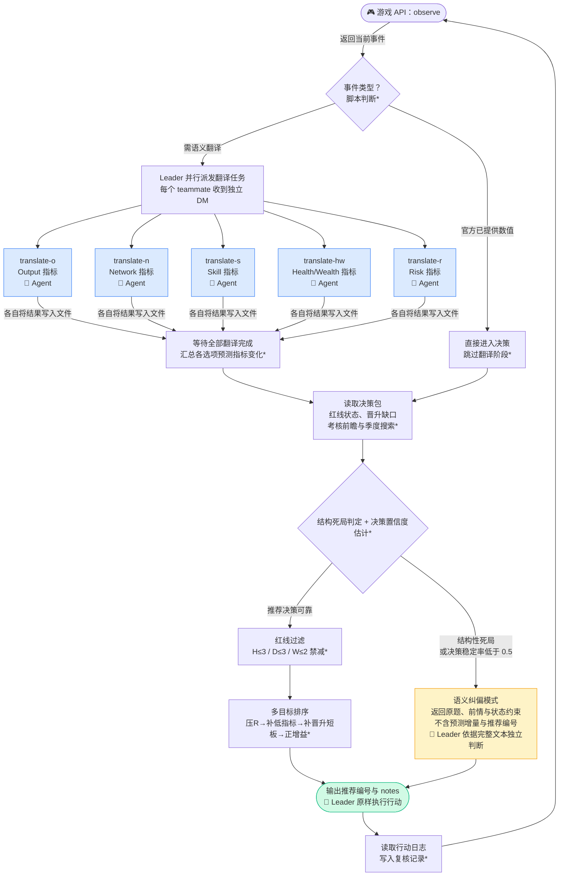

# 决策报告：Observe–Decide–Review 循环

> 对应实现：`solution/skills/observe-decide-review` v4.7.5
>
> 本文给出逐轮决策的完整流程、判据与数值依据；总体架构、Skill 职责边界、框架选用理由与资源开销论证见同目录 `skills_design.md`。

---

## 总览：每轮决策流程

> **图例**：`*` 标注的步骤由 Python 脚本完成；`🤖` 标注的步骤由 AI Agent 完成；蓝色节点为并行翻译 teammate，黄色为语义纠偏（例外路径），绿色为最终行动。

---

## 一、决策目标

在 48 个月的职业模拟中，以存活为前提，优先推进职级晋升，同时维持健康（H）、尊严（D）、财富（W）的安全余量，并将职业风险（R）压在低位。

这一目标被落实为脚本内一组统一的价值量化：任何一次选择都被折算为「该选择对目标的净影响」，而 Leader 每轮只收到折算后的最简结论（见 `skills_design.md` 3.4）。

在此之上，单次决策的执行顺序是固定的，且分为两个性质不同的环节：

**红线是过滤器。** H ≤ 3、D ≤ 3、W ≤ 2 的指标进入低位保护，任何预测会进一步削减它们的选项被无条件剔除，不参与后续比较。

**优先级是排序器。** 在通过过滤的候选中，依次比较以下四层，前一层相同才进入下一层：

1. **压低职业风险**：R > 1 时，优先降低风险而非追求增益；
2. **补足低位指标**：回补已处于保护状态的 H/D/W；
3. **补晋升短板**：S/O/N 中缺口最大者优先；
4. **其他正增益**：优先投向仍有成长空间的指标。

---

## 二、Translation：语义量化翻译

每轮事件包含若干选项，而每个选项对六项指标（S/O/N/H/W 与隐藏的 R）的影响，必须先从自然语言转化为可计算的数值增量——这是决策的唯一输入来源。

**翻译架构**：五个指标专家 teammate 并行完成翻译，各自只负责自己的指标，判断原则互不干扰：

| Teammate | 负责指标 | 核心判断原则 |
|---|---|---|
| translate-o | Output（资本绩效） | 是否产生了真实可见的核心业务成果；按当前可用成果、实际进度与生产投入判断，不按工作量、技术品质或个人前景定方向，远期收益与损失均不预支 |
| translate-n | Network（人脉） | 是否建立或强化了与同事、组织之间的有价值连接 |
| translate-s | Skill（技能） | 当前行动是否体现了专业技能、工作方法与职业问题处理能力的实质提升；态度、冒险程度与道德评价不代表能力变化 |
| translate-hw | Health / Wealth | H：须有题干或前情明确依据的持续身心耗损与已落实的恢复；W：只看本人的现实经济得失，不把公司资源或纯假设奖惩计入 |
| translate-r | Risk（隐患） | 是否引入新的职业暴露，或针对自身已有暴露落实了具体防护；不凭善意或收益判定安全 |

翻译结果一律写入结构化文件汇总，Agent 之间不经自然语言互传。

**官方数值优先**：若平台在季度行动和主行动中，直接给出了选项的数值变化（`status_updates`），则直接采用，不再翻译；只有缺少官方数值的选项才进入翻译流程。这既减少了不必要的 AI 调用，也提高准确性。

**D 不设翻译专家**：尊严（D）的现值由公开状态直接读取，选项的 D 增量仅在平台已给出官方数值时采用，否则记为 0。理由是 D 在多数事件中随其他指标附带变动，很少单独决定选项优劣；为它增设一名 teammate 的边际收益，低于其带来的 Token 与协调成本。

**增量值域**：所有翻译结果被强制约束为 −3 至 +3 的整数，越界即拒绝写入，符合游戏的实际数值尺度。

---

## 三、Translation-Sensitivity：决策置信度分析与事件分流

事件被翻译成指标增量之后，必须正视一个事实：**翻译误差可能大到翻转决策**。单项增量的取值范围只有 −3 到 +3，一处 ±1 的方向误判就可能改变选项排序；而在晋升资格线附近，1 点 S 的偏差直接决定一次晋升是否成立。因此我们不能把翻译结果直接当成最终决策依据，而是显式建模、量化其不确定性。

由此得到的**决策置信度**是分流开关：置信度足够的决策，让 Leader 原样执行（专家路径）；置信度不足或陷入死局的少数事件，放弃推荐，把原题与前情完整交回 Leader 做整体语义判断（语义路径）。

专家路径承担绝大多数事件，语义路径兜住少数高风险事件——本节给出这一分流的全部判据与数值依据（设计动机见 `skills_design.md` 5.4）。

### 3.1 条件误差模型

`translation-errors.json` 记录每个指标在「预测增量为 k」条件下实际误差的条件分布 `P(实际 − 预测 | 预测, 指标)`，覆盖 O/N/S/H/W 五项。

误差只施加于翻译得到的指标：平台已给出官方数值的选项视为确定值，不施加误差。

### 3.2 决策稳定率的计算

对每个翻译出的指标增量，比如 O+1，系统按误差模型生成 **32 组误差扰动**，比如 {O+1,O+1,O+0,O-1,O+2,...}，并按扰动后的翻译重跑推荐脚本，检查推荐选项是否仍然最优。

推荐保持不变的概率即**决策稳定率（confidence）**，也就是本节所称的决策置信度。

### 3.3 稳定率如何改变行动

**稳定率 ≥ 0.5**：按推荐决策执行，Leader 只拿到推荐编号与 notes。

**稳定率 < 0.5**，或出现**结构性死局**：放弃直接推荐，转而返回**原题、前情、原始选项与仅按当前状态计算的约束**，由 Leader 依据事件完整文本独立判断，并自行填写一句简短的行为理由。

结构性死局有三条判据，我们称此时翻译必定失败，稳定率为 0。任一成立即触发：

- 所有选项均预测触发淘汰；
- 所有选项的原始 S/O/N/H/D/W 均无正增量、且 R 均无下降，即整场事件为纯负面翻译；
- 所有选项均会破坏已经满足的晋升资格。

其中第二条需要注意边界：R 的下降计为正向收益，因此「有减险机会」的事件不算纯负面。

一旦进入纠偏，翻译结果全部丢弃。**不返回**带误差标注的预测增量，**不返回**推荐决策，消除任何 Bias，防止 Leader 看到指标翻译先入为主。

下表比较两类支持率阈值的量化原分中位数（满分 100，每组 128 局；行：R≤1，列：R>1 或未知）。

| 常规 / R | 0.9 | 0.8 | 0.75 | 0.7 | 0.65 | 0.6 |
|---|---:|---:|---:|---:|---:|---:|
| 0.9 | 53.750 | 57.740 | 59.460 | 58.790 | 56.375 | 56.435 |
| 0.8 | 59.795 | 61.975 | 62.165 | 60.835 | 60.665 | 60.925 |
| 0.75 | 63.480 | 64.525 | 64.950 | 65.345 | 64.785 | 64.180 |
| 0.7 | 62.075 | 65.330 | 65.360 | 65.705 | 65.610 | 65.610 |
| 0.65 | 63.685 | 65.515 | 65.725 | 65.725 | 65.580 | 64.655 |
| 0.6 | 60.055 | 62.620 | 63.650 | 63.685 | 63.240 | 62.810 |

### 3.4 该机制的边界

我们假设**在问卷最简的情况下，指定误差模型下的稳定率，与真实比赛中的预测正确率接近**。因此它被用作「是否放弃符号推荐」的门控信号，而不用作对推荐质量的绝对度量。

---

## 四、Decide：多目标决策

脚本先按选项是否携带官方数值 `status_updates` 把事件分为三类：全部携带的，按是否消耗体力分为**体力事件**与**主行动事件**，直接采用官方增量、跳过翻译；只要有一项缺失，即为**叙事事件**，进入翻译流程。三类的可选空间与约束结构不同，因此走不同的排序路径。

翻译汇总完成后，决策按以下三步执行。

**第一步：红线过滤**

H ≤ 3、D ≤ 3、W ≤ 2 时该指标进入低位保护，所有预测会进一步削减已过低指标的选项被无条件排除，无论其他维度收益多大。这一过滤在一切排序之前执行，不可被领导指令、情节压力或其他指标收益绕过。若过滤后候选为空，不返回推荐，直接转入语义纠偏路径。

**第二步：投影与前瞻排序**

每个候选先被投影为「执行后的状态」：套用当前职级的成长上限与各项指标下限，并对财富损失按职级缩放——职级越高，同样数额的损失越难挽回。随后按事件类型排序：

- **叙事事件**：以净值比较，即统一价值量化下的状态差，扣除财富损失折价，再叠加晋升缺口、资格线回退、职业风险与临期健康的定价。在评审前一个月，比较的是**评审结算后**的结果，而非当前增量。
- **体力事件**：调用季度组合搜索（至多 3 次体力行动 + 1 次主行动），返回最优序列的第一步；若搜索无解，则退回不消耗体力的选项。
- **主行动事件**：以季度目标函数取最优，比较顺序为存活与风险 → 低位指标回补 → 评审后存活 → 晋升是否成立 → 晋升缺口 → 绩效。

**第三步：输出最简决策包**

脚本只输出推荐编号与一句可直接提交的 notes，Leader 原样采用，不重新翻译、不改写（见 `skills_design.md` 3.4）。

当出现结构性死局，或决策置信度低于 0.5 时，脚本改为返回原题、前情与仅按当前状态计算的约束，由 Leader 依据完整事件文本独立判断（第三节）。此路径下红线约束依然有效，不得放宽。

---

## 五、长期规划：晋升路径管理

长期规划的完整机制与设计动机见 `skills_design.md` 第三节；此处只列出它进入每一轮决策的接口。前三者共用同一套定价，因此不存在「长期目标」与「当轮收益」相互打架的情况。

**晋升资格与缺口**：系统按职级维护晋升所需的资格画像，每次决策前把当前 S/O/N 与下一职级要求逐项比对，得到一组带符号的缺口；缺口最大者作为本轮补短板目标，并在净值中获得最高权重。跨多个事件周期的策略因此始终朝同一资格线收敛，而不必依赖任何显式的多轮计划。

**考核前瞻**：每逢评审前一个月（第 5、11、17……47 月），决策不再只看当前增量，而是推演评审结算——绩效分、谈话结果、晋升是否成立、薪资与奖金、晋升附带的人脉惩罚、评审后是否存活——再据此选择。临近终局且已预测通过最后一次晋升时，停止为后续晋升追加绩效投入，把资源转向结局指标。

**季度搜索**：每季度的体力与主行动按组合而非逐个求最优，行动执行后重新规划。跨季度的一致性来自「每步都对同一目标重新求最优」，而非来自对既定计划的机械执行。

**晋升信号台账**：每次【半年谈话】、绩效奖金与晋升通知后，系统记录当时的 O/S/N/R 状态、下一个晋升点与反馈结果，用于事后校验推算与实际之间的偏离，构成长期规划的一致性证据链。

---

## 六、Review：闭环反馈

每次行动后，Leader 从官方 session log 读取实际执行结果，交由复核脚本处理。复核是自学习闭环的起点，同时承担三件事：

**其一，写入行动回执并推进阶段。** 回执记录事件 ID、观察哈希、所选编号、官方实际增量与日志游标。复核只在 decide 之后可用，且日志游标必须单调前进——已消费或被替换的日志不得再次复核。

**其二，留下下一轮的比对基准。** 复核在红线台账追加一行标记为「待判定」的记录，保存本轮行动后的**预测状态**。下一次 observe 到来时，脚本用实际观察值与之比对：若某指标实际值低于预测值、且本轮无公开事件，则说明该指标在当前职级已无成长空间，后续排序不再为它追加投入。长期规划因此不依赖任何先验常量，而是随对局观察逐轮校准。

**其三，缓存翻译反馈。** 把本轮的「预测增量 vs 实际增量」写入问卷反馈缓存，供下一轮 teammate 的自进化使用（第七节）。

复核写入是幂等的：重复调用得到相同结果，字段冲突则报错而非覆盖。终局时官方 `ending_score` 被原样保存，可用于事后校准整套符号模型的偏差。

---

## 七、问卷自进化

每个指标翻译 teammate 在每轮开始时，先检查当前事件类型在历史中是否出现过同类误判。若发现可归纳的典型错误，便在正式答题前对问卷做一处最小化修改（补充判断边界或修正方向偏差），随后以更新后的问卷重新翻译当前事件；归纳不出典型错误时允许明确跳过。翻译质量因此随对局单调改善，且不增加任何额外的 Agent 往返。

只有**方向性误判**（预测增大而实际减小，或反之）会触发修改；仅有幅度偏差的反馈被直接忽略，因为幅度噪声不值得为它改写判据。

修改的硬性约束——只改单题文案、不改取值与算式、单处长度有上限、被替换短句须唯一出现、不得删除已有有效边界、不得过拟合单一情境——由脚本逐条校验，而非仅靠提示词要求；各项约束的设计理由见 `skills_design.md` 7.3。

问卷按 session 隔离记录修改，并以版本指纹参与回执校验：任何一次问卷变更都会立即使旧回执失效，从机制上排除「用上一版问卷的答案回答这一版问卷的题」。R 为隐藏指标，无公开真值可供校准，不开放问卷修改。
